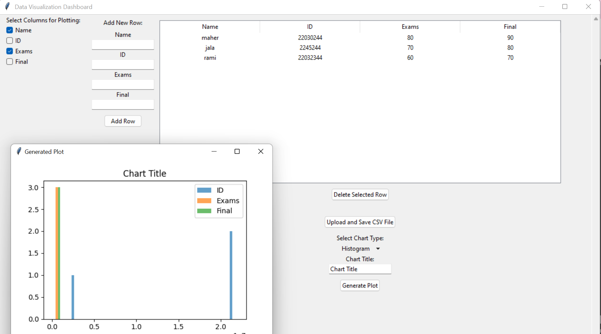

# 📊 Data Visualization Dashboard

Python-based interactive dashboard for data analysis and visualization using Pandas, Matplotlib, and Tkinter.

---

## 🚀 Overview
This project is a desktop application that allows users to upload CSV files and generate different types of charts for data visualization.

It provides a simple and user-friendly interface to explore datasets and create visual insights.

---

## ⚙️ Features
- Upload and read CSV files
- Select chart types (Bar Chart, etc.)
- Customize chart titles
- Generate plots dynamically
- Interactive GUI using Tkinter

---

## 🛠️ Technologies Used
- Python
- Pandas
- Matplotlib
- Tkinter

---

## ▶️ How to Run

1. Install required libraries:
```bash
pip install -r requirements.txt

## 📸 Preview


